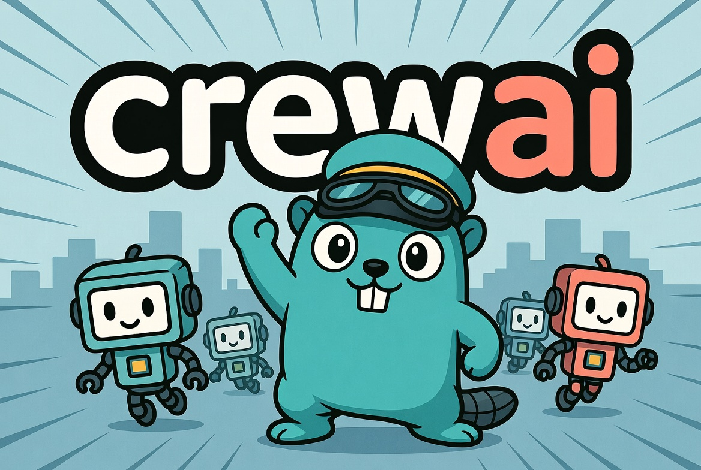

# crewai-go

> **Languages:** [English](README.md) · **Português** (atual)

[](https://pkg.go.dev/github.com/rhgs/crewai-go)

[](https://github.com/rhgs/crewai-go/actions/workflows/ci.yml)

<p align="center">
  
</p>

**Orquestração de agentes de IA autônomos e colaborativos, em Go.**

`crewai-go` é um port idiomático em Go do framework [CrewAI](https://github.com/crewAIInc/crewAI). Ele permite montar equipes (_crews_) de agentes com papéis distintos que colaboram — de forma sequencial ou hierárquica — para concluir tarefas complexas usando modelos de linguagem (LLMs).

> Feito com **zero dependências externas** — apenas a biblioteca padrão do Go. Fácil de instalar, auditar e integrar.

---

## Sumário

- [Por que crewai-go](#por-que-crewai-go)
- [Conceitos](#conceitos)
- [Instalação](#instalação)
- [Início rápido](#início-rápido)
- [Provedores de LLM](#provedores-de-llm)
- [Ferramentas](#ferramentas)
- [Processos: sequencial e hierárquico](#processos-sequencial-e-hierárquico)
- [Saida estruturada](#saida-estruturada)
- [Guardrails](#guardrails)
- [Facts e proveniência](#facts-e-proveniência)
- [Memória](#memória)
- [Exemplos](#exemplos)
- [Documentação](#documentação)
- [Testes](#testes)
- [Comparação com o CrewAI (Python)](#comparação-com-o-crewai-python)
- [Licença](#licença)

---

## Por que crewai-go

- 🧩 **API simples e composável** — `Agent`, `Task`, `Crew`, `Tool`, `LLM`.
- ⚡ **Sem dependências** — só stdlib; builds pequenos e rápidos.
- 🔌 **Qualquer LLM** — OpenAI (e compatíveis: Ollama, Groq, Azure…), Anthropic (Claude) e qualquer implementação sua da interface `LLM`.
- 🛠️ **Ferramentas via ReAct** — agentes raciocinam e chamam ferramentas em texto.
- 📋 **Saída estruturada** — tarefas podem exigir JSON validado contra um JSON Schema, com loop de reparo limitado.
- 🛡️ **Guardrails** — validação pós-saída em código que bloqueia publicação de saídas que violam invariantes de negócio.
- 📌 **Facts e proveniência** — tipo Fact de primeira classe, populado apenas por ferramentas conectoras determinísticas, nunca pelo LLM, com metadados de proveniência completos.
- 🧠 **Memória** entre tarefas e **contexto** encadeável.
- 👔 **Processo hierárquico** com gerente que delega dinamicamente.
- ✅ **Testável** — LLM mock incluído; ~90% de cobertura no núcleo.

## Conceitos

| Conceito     | O que é                                                                 |
|--------------|-------------------------------------------------------------------------|
| **Agent**    | Um trabalhador com papel, objetivo, história, um LLM e ferramentas.     |
| **Task**     | Uma unidade de trabalho com descrição, saída esperada e responsável.    |
| **Crew**     | A equipe: agrupa agentes e tarefas e as orquestra.                      |
| **Process**  | Estratégia de execução: `Sequential` ou `Hierarchical`.                 |
| **Tool**     | Uma capacidade que o agente pode invocar (cálculo, busca, API…).        |
| **LLM**      | Abstração do modelo de linguagem. Vários provedores prontos.            |
| **Memory**   | Armazena saídas de tarefas para dar contexto às seguintes.             |
| **StructuredOutput** | Configura uma tarefa para exigir JSON validado por um JSON Schema. |
| **Guardrail** | Hook de validacao pos-saida que bloqueia publicacao de saidas invalidas. |
| **Fact** | Dado de um conector deterministico com proveniencia (fonte, hash). |
| **FactSource** | Interface opcional para tools que produzem Facts. |

## Instalação

Requer **Go 1.24+**.

```bash
go get github.com/rhgs/crewai-go@latest
```

No seu código:

```go
import "github.com/rhgs/crewai-go"
```

## Início rápido

```go
package main

import (
	"context"
	"fmt"
	"log"

	"github.com/rhgs/crewai-go"
	"github.com/rhgs/crewai-go/llm/openai"
)

func main() {
	// 1. Escolha um LLM (usa OPENAI_API_KEY do ambiente).
	llm := openai.New("gpt-4o-mini")

	// 2. Crie um agente.
	poeta := crewai.NewAgent(
		"Poeta",
		"Escrever poemas curtos e memoráveis",
		"Você é um poeta premiado, mestre da concisão.",
		llm,
	)

	// 3. Defina uma tarefa.
	tarefa := crewai.NewTask(
		"Escreva um haikai sobre a linguagem Go.",
		"Um haikai (3 versos) em português.",
		poeta,
	)

	// 4. Monte a crew e execute.
	crew := crewai.NewCrew([]*crewai.Agent{poeta}, []*crewai.Task{tarefa})
	out, err := crew.Kickoff(context.Background(), nil)
	if err != nil {
		log.Fatal(err)
	}
	fmt.Println(out.Final)
}
```

```bash
export OPENAI_API_KEY=sk-...
go run .
```

## Provedores de LLM

Qualquer tipo que implemente a interface abaixo funciona:

```go
type LLM interface {
	Call(ctx context.Context, messages []Message) (string, error)
	Model() string
}
```

Prontos para uso:

```go
import (
	"github.com/rhgs/crewai-go/llm/openai"
	"github.com/rhgs/crewai-go/llm/anthropic"
	"github.com/rhgs/crewai-go/llm/ollama"
	"github.com/rhgs/crewai-go/llm/xai"
	"github.com/rhgs/crewai-go/llm/mock" // para testes
)

// OpenAI (e compatíveis: Groq, Azure, Together…)
llm := openai.New("gpt-4o-mini")

// Anthropic (Claude)
llm := anthropic.New("claude-sonnet-5")

// Ollama local (sem chave)
llm := ollama.New("llama3.2")

// Ollama Cloud (usa OLLAMA_API_KEY)
llm := ollama.NewCloud("gpt-oss:120b")

// xAI (Grok) por chave de API
llm := xai.New("grok-4")

// xAI (Grok) por OAuth de assinatura (SuperGrok / X Premium) — sem chave cobrada
df := xai.NewDeviceFlow(clientID)
ts, _ := xai.LoadTokenSource("~/.crewai-xai-token.json", df)
llm := xai.NewWithOAuth("grok-4", ts)
```

| Provedor | Pacote | Autenticação |
|----------|--------|--------------|
| OpenAI (e compatíveis) | `llm/openai` | `OPENAI_API_KEY` / `WithTokenSource` |
| Anthropic (Claude) | `llm/anthropic` | `ANTHROPIC_API_KEY` |
| Ollama local | `llm/ollama` (`New`) | nenhuma |
| Ollama Cloud | `llm/ollama` (`NewCloud`) | `OLLAMA_API_KEY` |
| xAI (Grok) — API key | `llm/xai` (`New`) | `XAI_API_KEY` |
| xAI (Grok) — assinatura | `llm/xai` (`NewWithOAuth`) | OAuth Device Flow |
| Mock (testes) | `llm/mock` | nenhuma |

Veja [`docs/llms.md`](docs/llms.md) para todas as opções.

## Ferramentas

Crie uma ferramenta a partir de qualquer função Go:

```go
busca := crewai.NewTool(
	"busca_web",
	"Busca um termo na web. Entrada: o termo de busca.",
	func(ctx context.Context, termo string) (string, error) {
		// ... sua lógica ...
		return resultado, nil
	},
)

agente.WithTools(busca)
```

Ferramentas embutidas no pacote `tools`:

```go
import "github.com/rhgs/crewai-go/tools"

agente.WithTools(
	tools.Calculator(),        // avalia expressões aritméticas
	tools.CurrentTime(""),     // data/hora atual
	tools.WordCount(),         // conta palavras/caracteres
)
```

O agente usa ferramentas via o protocolo **ReAct** (`Thought → Action → Action Input → Observation → Final Answer`). Detalhes em [`docs/tools.md`](docs/tools.md).

## Processos: sequencial e hierárquico

**Sequencial** — tarefas em ordem, cada saída vira contexto da próxima:

```go
crew := crewai.NewCrew(agentes, tarefas)
crew.Process = crewai.Sequential
```

**Hierárquico** — um gerente delega cada tarefa ao agente mais adequado:

```go
crew.Process = crewai.Hierarchical
crew.ManagerLLM = llm // ou crew.ManagerAgent = meuGerente
```

Encadeie contexto explicitamente com `WithContext`:

```go
analise := crewai.NewTask("Analise os dados", "insights", analista).
	WithContext(coleta) // recebe a saída da tarefa 'coleta'
```

## Saida estruturada

Quando uma tarefa precisa de dados tipados e confiaveis (ex. para
persistir em um banco de dados), defina o campo `Structured` com um JSON
Schema. O executor instrui o modelo a responder apenas com JSON, valida a
saida em Go, e tenta reparar ate `RepairMax` vezes se a validacao falhar.

```go
schema := map[string]any{
    "type": "object",
    "properties": map[string]any{
        "name":  map[string]any{"type": "string"},
        "count": map[string]any{"type": "integer"},
    },
    "required": []string{"name", "count"},
}

structured, _ := crewai.NewStructuredOutput(schema, crewai.WithRepairMax(3))

tarefa := crewai.NewTask("Extraia o nome e a contagem do produto.", "JSON", agente)
tarefa.Structured = structured
```

Em caso de sucesso, `tarefa.Output()` retorna o JSON **canonizado**
(compactado, estavel). Se o modelo nunca produzir JSON valido dentro do
budget de reparo, a tarefa falha com `crewai.ErrRepairBudgetExceeded`. O
executor nunca retorna JSON invalido ou inventa dados.

O validador embutido suporta um subconjunto do JSON Schema (`type`,
`properties`, `required`, `enum`, `items`) — apenas stdlib, sem
dependencias externas. Detalhes em [`docs/pt-BR/tasks.md`](docs/pt-BR/tasks.md).

## Guardrails

Guardrails sao hooks de validacao pos-output aplicados em codigo. Eles rodam
depois que a crew (ou tarefa) produz a saida e bloqueiam a publicacao se uma
invariante de negocio for violada. Diferente de instrucoes no prompt,
guardrails sao uma garantia em codigo.

```go
crew.Guardrails = []crewai.Guardrail{
    func(_ context.Context, out *crewai.CrewOutput) error {
        if !strings.Contains(out.Final, "http") {
            return fmt.Errorf("faltando URL de origem")
        }
        return nil
    },
}
```

Guardrails de task tambem podem ser definidos via `tarefa.WithGuardrail(...)`.
Em caso de falha, `Kickoff` retorna `crewai.ErrBlockedByGuardrail` — a saida
nunca e parcialmente retornada. Detalhes em [`docs/pt-BR/crews.md`](docs/pt-BR/crews.md).

## Facts e proveniencia

Um **Fact** e uma peca de dado produzida por um conector deterministico, nao
pelo LLM. Carrega proveniencia (fonte, URL, timestamp, hash do payload) para
que um valor errado nunca possa ser apresentado como um "fato que o modelo
lembrou".

```go
tool := crewai.NewFactSourceTool(
    "cnpj_lookup",
    "Consulta status do CNPJ. Entrada: o numero do CNPJ.",
    func(_ context.Context, cnpj string) (string, error) { /* ... */ },
    func(_ context.Context, output string) []crewai.Fact {
        return []crewai.Fact{
            crewai.NewFact(output, "Receita Federal", "https://...", []byte(rawPayload)),
        }
    },
)
```

Facts vem apenas de tools, nunca do modelo. Sao deduplicados por PayloadHash
e aparecem em `CrewOutput.Facts` e `TaskOutput.Facts`. Use
`crewai.AllFactsProvenanced` em um guardrail para exigir proveniencia. Detalhes
em [`docs/pt-BR/tools.md`](docs/pt-BR/tools.md).

## Memória

```go
crew.Memory = true
// ...
crew.Kickoff(ctx, nil)

for _, r := range crew.MemorySnapshot().Records() {
	fmt.Printf("[%s] %s\n", r.Agent, r.Content)
}
```

## Exemplos

Execute os exemplos incluídos:

```bash
go run ./examples/custom_llm     # offline, sem chave de API
go run ./examples/ollama         # Ollama local (ou OLLAMA_CLOUD=1)

export OPENAI_API_KEY=sk-...
go run ./examples/basic
go run ./examples/sequential
go run ./examples/hierarchical
go run ./examples/tools

export XAI_API_KEY=xai-...        # ou XAI_OAUTH=1 + XAI_CLIENT_ID
go run ./examples/xai_oauth
```

## Documentação

> 📖 Toda a documentação está disponível em **Português** (este) e **English** (padrão, `docs/*.md` / `*.md`). Cada arquivo tem um link de troca de idioma no topo.

| Guia | Português | English |
|------|-----------|---------|
| Getting Started | [PT](docs/pt-BR/getting-started.md) | [EN](docs/getting-started.md) |
| Agents | [PT](docs/pt-BR/agents.md) | [EN](docs/agents.md) |
| Tasks | [PT](docs/pt-BR/tasks.md) | [EN](docs/tasks.md) |
| Crews | [PT](docs/pt-BR/crews.md) | [EN](docs/crews.md) |
| Tools | [PT](docs/pt-BR/tools.md) | [EN](docs/tools.md) |
| LLMs | [PT](docs/pt-BR/llms.md) | [EN](docs/llms.md) |
| Memory | [PT](docs/pt-BR/memory.md) | [EN](docs/memory.md) |
| Plano / Roadmap | [PT](PLAN.pt-BR.md) | [EN](PLAN.md) |

## Testes

```bash
go test ./...            # todos os testes
go test ./... -cover     # com cobertura
go vet ./...             # análise estática
```

Os testes são **hermeticos**: usam o LLM `mock` e `httptest`, sem chamadas de rede reais.

## Comparação com o CrewAI (Python)

| CrewAI (Python)        | crewai-go                         |
|------------------------|-----------------------------------|
| `Agent(role=...)`      | `crewai.NewAgent(role, ...)`      |
| `Task(description=...)`| `crewai.NewTask(desc, ...)`       |
| `Crew(agents, tasks)`  | `crewai.NewCrew(agents, tasks)`   |
| `crew.kickoff(inputs)` | `crew.Kickoff(ctx, inputs)`       |
| `Process.sequential`   | `crewai.Sequential`               |
| `Process.hierarchical` | `crewai.Hierarchical`             |
| `@tool` / `BaseTool`   | `crewai.NewTool` / `crewai.Tool`  |
| litellm                | interface `LLM` (openai/anthropic)|

Este port cobre o núcleo do CrewAI (agentes, tarefas, crews, processos, ferramentas, memória). Recursos avançados do projeto original (Flows event-driven, training, telemetria) não fazem parte desta versão.

## Licença

[MIT](LICENSE).

## Changelog

Veja [CHANGELOG.pt-BR.md](CHANGELOG.pt-BR.md) (PT) / [CHANGELOG.md](CHANGELOG.md) (EN).
